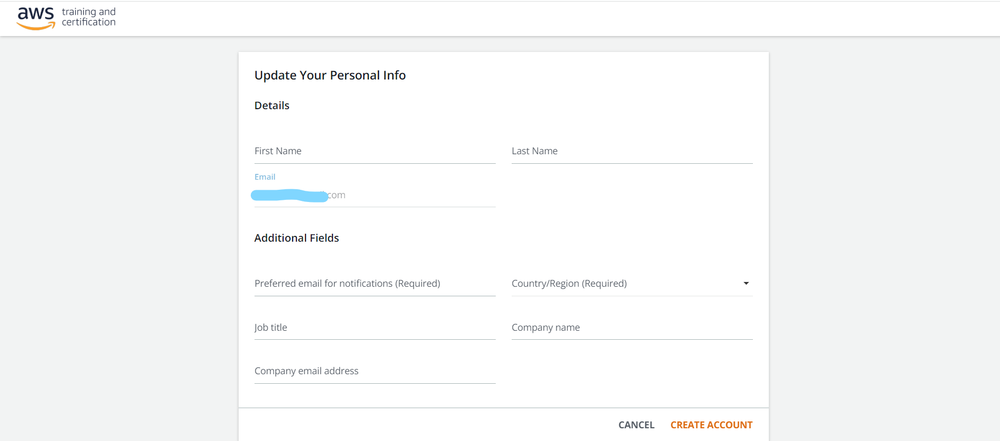
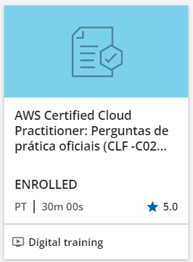
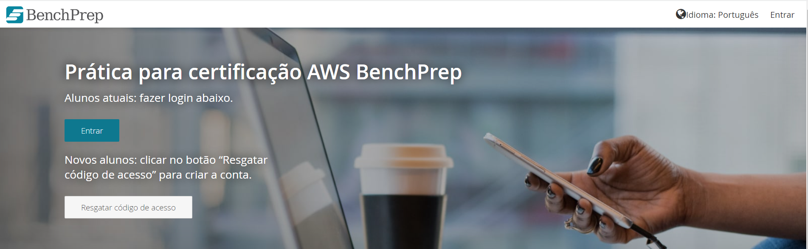

# Prova Oficial

## Ambientes Operacionais

Turmas:

* BD 2A

# Instruções

1. Acesse https://explore.skillbuilder.aws/learn

2. No canto superior direito, verifique o idioma. Se estiver , siga para o próximo passo. Se estiver  ou qualquer outro idioma, clique no idioma e selecione 

3. Ainda no canto superior direito, clique em 

4. No modal clique em 

5. Na nova tela verifique novamente o idioma no canto superior direito e escolha 

6. Clique em  e depois em 

7. Na nova tela de login clique em   **para criar uma nova conta com o e-mail institucional da faculdade. A prova somente será aceita com este e-mail**

    7.1. Caso já tenha criado a conta com o e-mail da impacta e queira autenticar siga para o passo 12

8. Preencha o formulário de cadastro e clique em   

9. Insira o código de validação enviado para seu e-mail e clique em   

10. Na próxima tela clique em   

11. Se ocorrer um erro volte ao passo 1 e execute o processo até o passo 6. Siga de acordo com o que for mostrado

12. Se for mostrada a tela de login, faça o login com a conta da impacta criada e siga para o próximo passo

13. Se for mostrada uma tela para incluir o telefone celular clique em  

14. Na próxima tela clique em  

15. Caso um novo erro apareça, tente novamente o passo a partir do começo Se não acontecer erro, vá para o próximo passo  
    
16. Na nova tela clique em  

17. Você deve conseguir ver um formulário para completar o cadastro como da imagem abaixo. Preencha o formulário e clique em  

18. Você será redirecionado para o SkillBuilder

19. Na barra de pesquisa superior ()  `AWS Certification Official Practice Question Sets (Portuguese)` e selecione a opção  (provavelmente a primeira opção)

20. Na tela do curso clique em 

21. No modal clique em  para ser direcionado para a tela do curso

22. Clique em  ao lado direito

22. Na nova tela clique em . Uma nova janela será aberta no sistema `BenchPrep`

23. No `BenchPrep` troque o idioma para português no canto superior direito

23. Após trocar o idioma clique em 

24. Na nova janela aberta, insira o código que aparece na tela do passo 22 e clique em 

25. Crie uma nova conta se estiver acessando pela primeira vez e clique em   ao lado direito

26. Clique em  

